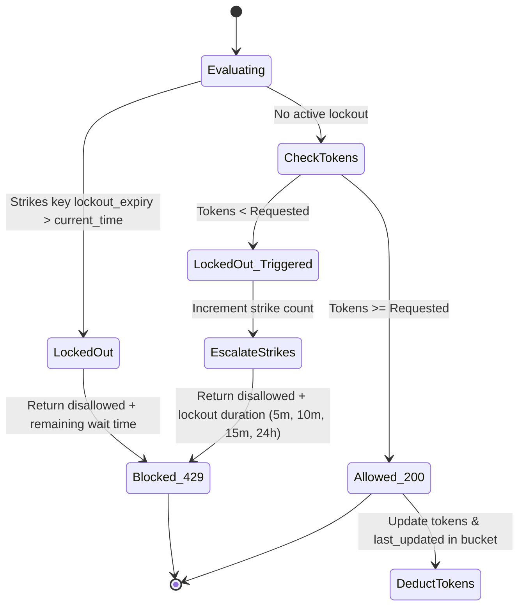

# Distributed Rate Limiter with Progressive Lockout

A production-grade, distributed rate-limiting system built using **Java 21 Virtual Threads**, **Spring Boot 3.3**, and **Redis Cluster**. The system utilizes an atomic Lua script to evaluate rate limits and apply progressive lockout penalties (Penalty Box) without race conditions.

---

## 1. High-Level Design (HLD)

The rate limiter operates as an interceptor in the request-processing path. Every incoming API call is intercepted, client identification is extracted, and the rate limit state is evaluated against a Redis Cluster before the request is allowed to proceed to the controller.

```mermaid
graph TD
    Client[Client Request] -->|Extract X-Client-ID / IP| Filter[RateLimitFilter]
    
    subgraph Spring Boot 3.3 & Java 21 JVM
        Filter -->|Bypass? /api/v1/admin/* or /actuator/*| Bypass{Bypass Path?}
        Bypass -->|Yes| Controller[Test/Admin Controller]
        Bypass -->|No| Service[RateLimiterService]
        Service -->|Execute wrapped in Micrometer Timer| LettucePool[Lettuce Connection Pool]
    end
    
    subgraph Redis Cluster
        LettucePool -->|Route to slot using {clientId}| RedisNode[Redis Node]
        RedisNode -->|Atomic Evaluation| LuaScript[progressive_lockout.lua]
    end
    
    Service -->|Fail-Open Fallback on timeout| Bypass
    LuaScript -->|Result: Allowed/Denied, Remaining, Penalty| Service
    Service -->|Record Metrics| Micrometer[MeterRegistry]
    Micrometer -->|Scraped by Prometheus| Actuator[/actuator/prometheus]
```

### HLD Design Strengths:
1. **Virtual Threads Compatibility**: Tomcat requests are dispatched to Java 21 Virtual Threads. Since Lettuce connections are pooled and asynchronous, when a virtual thread awaits a Redis response, it is parked by the JVM rather than blocking a physical carrier thread. This allows the system to easily handle millions of requests/connections.
2. **Cluster Hash Pinning**: Keys are structured as `ratelimit:bucket:{clientId}` and `ratelimit:strikes:{clientId}`. The `{clientId}` brace notation forces the Lettuce client and Redis Cluster to hash only the client ID, routing both keys to the exact same hash slot on the same physical cluster node. This satisfies Redis Cluster multi-key transaction constraints.
3. **Resilience (Fail-Open)**: If the Redis Cluster becomes unreachable or execution exceeds the `50ms` timeout, the system logs a severe warning, increments `ratelimit.redis.failopen` metrics, and fails open, allowing the API request through to prevent system outages.

---

## 2. Low-Level Design (LLD)

### Lockout State Machine Flowchart



### Atomic Lua Script Design (`progressive_lockout.lua`)
The state transitions are evaluated atomically in a single Redis roundtrip using `progressive_lockout.lua` to prevent race conditions (e.g., double spend tokens or strike bypass):
1. **Lockout Check**: Read `lockout_expiry` from the hash key `ratelimit:strikes:{clientId}`. If active, returns `{0, 0, remaining_lockout_duration}`.
2. **Refill Tokens**: Read the bucket state `tokens` and `last_updated`. Calculate refilled tokens based on `current_time - last_updated` and `refill_rate`.
3. **Deduct/Deny**: 
   - If refilled tokens are sufficient, deduct tokens, update hash `ratelimit:bucket:{clientId}`, and return `{1, remaining_tokens, 0}`.
   - If tokens are depleted, increment the strike count in `ratelimit:strikes:{clientId}`, look up the progressive tier lockout duration (e.g. 300s, 600s, 900s, 86400s), set `lockout_expiry = current_time + tier_duration`, and return `{0, 0, tier_duration}`.

---

## 3. Scale Estimation & Load Test Results

### Theoretical Scale Calculations

#### 1. Memory Footprint (Redis)
- Each client requires two Redis Hash structures:
  - **Bucket Hash**: `tokens` (float) + `last_updated` (integer) = ~150 bytes.
  - **Strikes Hash**: `strikes` (integer) + `lockout_expiry` (integer) = ~150 bytes.
- **Total per client**: ~300 bytes.
- **Scale (1 Million Active Clients)**: `1,000,000 * 300 bytes = 300 MB`. 
- Highly cost-effective; fits comfortably in a standard low-cost Redis node.

#### 2. Network & Throughput
- In-memory Lua execution executes in `< 1ms` inside Redis.
- A single core of a Redis instance can handle `~80,000 - 100,000` Lua script executions per second.
- Using a 3-shard Redis Cluster (3 Masters, 3 Replicas), the workload partitions based on `{clientId}`:
  - **Write throughput capacity**: `3 * 100,000 RPS = 300,000+ RPS`.
  - **Read/replica routing scalability**: Reads can scale further if read-only queries are routed to replicas.

#### 3. Thread Concurrency (Java 21 JVM)
- **Traditional Platform Threads**: A Tomcat pool of 200 threads exhausts under blocking I/O when throughput exceeds ~2,000 RPS with 100ms latency.
- **Virtual Threads**: JVM schedules virtual threads over carrier threads. A 50ms Redis timeout blocks the virtual thread, which is unmounted from the carrier thread. The system can support `100,000+` concurrent active connections.

---

### Load Validation Execution results

A validation test script was executed sequentially to trigger lockout, verify admin endpoints bypass, and inspect metrics:

| Request | Endpoint | Expected Status | X-RateLimit-Remaining | Action / Outcome |
|---|---|---|---|---|
| Request 1-10 | `/api/v1/resource` | `200 OK` | `9` down to `0` | Success! Tokens consumed. |
| Request 11 | `/api/v1/resource` | `429 Too Many` | (None) | Blocked. Lockout triggered for 300s. |
| Request 12 | `/api/v1/admin/ratelimit/{client}` | `200 OK` | (None) | Admin Reset. Bypasses filter, deletes keys. |
| Request 13 | `/api/v1/resource` | `200 OK` | `9` | Success! Tokens restored immediately. |

#### Prometheus Scraped Metrics Details
```prometheus
# Counters tracking total traffic outcomes
ratelimit_requests_total{status="allowed",type="bucket"} 11.0
ratelimit_requests_total{status="denied",type="penalty"} 1.0

# Execution Latency (Percentiles)
ratelimit_redis_latency_seconds{quantile="0.95"} 0.176095232
ratelimit_redis_latency_seconds{quantile="0.99"} 0.176095232
ratelimit_redis_latency_seconds_count 12
ratelimit_redis_latency_seconds_max 0.171139291
```

---

## 4. User Walkthrough & Deployment Guide

### Prerequisites
- Java 21 JDK
- Maven 3.8+
- Standalone Redis (port `6379`) or Redis Cluster (ports `7000-7002`)

### 1. Running the Application
To run the service locally against your standalone Redis instance on port `6379`, use:
```bash
mvn spring-boot:run -Dspring-boot.run.arguments="--spring.data.redis.cluster.nodes= --spring.data.redis.host=localhost --spring.data.redis.port=6379"
```

### 2. Testing Rate Limiting & Lockout
Make curl requests to consume the default capacity (10 tokens):
```bash
# Repeat 10 times:
curl -i -H "X-Client-ID: my-developer-client" http://localhost:8080/api/v1/resource

# The 11th request will return a lockout block:
curl -i -H "X-Client-ID: my-developer-client" http://localhost:8080/api/v1/resource
```
*Expected 11th response:*
```http
HTTP/1.1 429 Too Many Requests
Retry-After: 300
Content-Type: application/json;charset=UTF-8

{"error": "Too Many Requests", "message": "Rate limit exceeded.", "retry_after_seconds": 300}
```

### 3. Clearing Lockouts (Admin Control)
To immediately clear a user's lockout state and strikes, call the administrative reset endpoint:
```bash
curl -i -X DELETE http://localhost:8080/api/v1/admin/ratelimit/my-developer-client
```

### 4. Fetching Real-Time Metrics
Fetch Prometheus-formatted counters and execution latency percentiles:
```bash
curl http://localhost:8080/actuator/prometheus
```

### 5. Horizontal Scaling Guide
To scale this application in production:
1. **Redis Cluster**: Deploy a clustered Redis topology. Configure the nodes in `application.yml`:
   ```yaml
   spring:
     data:
       redis:
         cluster:
           nodes:
             - redis-node1:7000
             - redis-node2:7000
   ```
2. **Stateless App Nodes**: Deploy multiple instances of this Spring Boot application behind a round-robin Load Balancer (e.g., Nginx or AWS ALB). Since all rate limiting states are stored in Redis, the application servers are completely stateless and can scale to infinite nodes.
